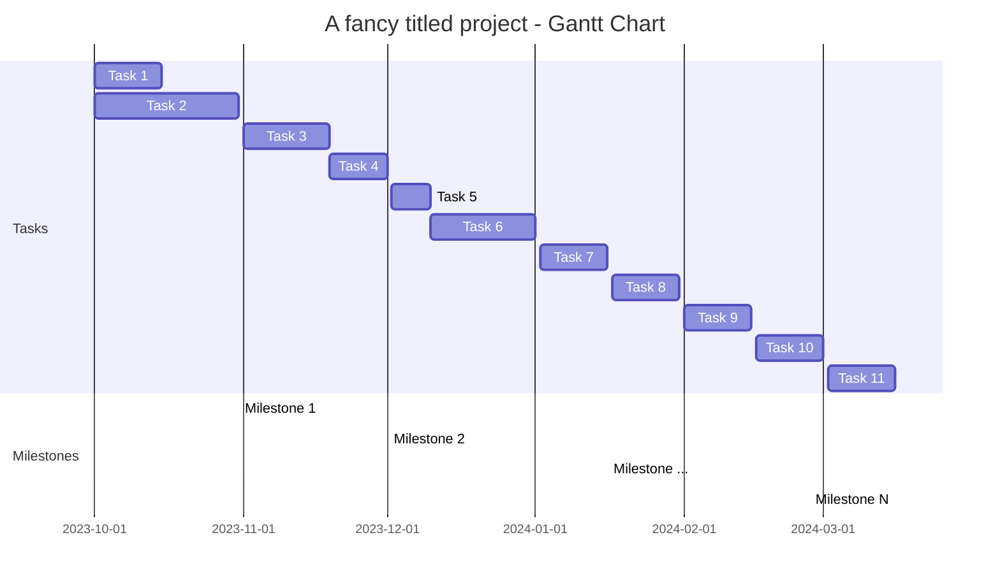

# A fancy titled project - Project Schedule

## Tasks
 - Task 1:
 - Task 2:
 - Task 3:
 - Task ...:
 - Task 10:
 - Task 11:

## Milestones
 - Milestone no. 1: SMART description of the milestone
 - Milestone no. 2: SMART description of the milestone
 - Milestone no. ...: SMART description of the milestone
 - Milestone no. N: [Final presentation]: SMART description of the milestone

 ## Gantt chart

More about how to make a gantt chart in mermaid, you will find here: [Mermaid Gantt](https://mermaid.js.org/syntax/gantt.html)